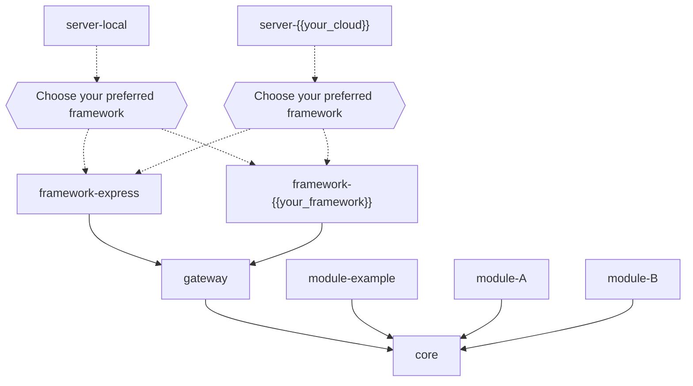

# monomod

A Modular Monolith Framework for TypeScript


- [monomod](#monomod)
  - [Overview](#overview)
    - [When to Use monomod?](#when-to-use-monomod)
    - [Features](#features)
    - [Included Tools](#included-tools)
    - [Key Concepts](#key-concepts)
    - [Best Practices](#best-practices)
    - [Scaling Strategy](#scaling-strategy)
  - [Architecture](#architecture)
    - [Project Structure](#project-structure)
    - [Module Structure](#module-structure)
    - [Project Diagram](#project-diagram)
  - [Getting Started](#getting-started)
    - [Prerequisites](#prerequisites)
    - [Basic Setup](#basic-setup)
    - [Upgrading the NX version (Optional)](#upgrading-the-nx-version-optional)
    - [Pushing your changes](#pushing-your-changes)
  - [Common Commands](#common-commands)
  - [Documentation and Resources](#documentation-and-resources)
  - [Troubleshooting](#troubleshooting)
  - [Support](#support)
  - [Contributing](#contributing)
    - [Contributors](#contributors)
  - [License](#license)
  - [Acknowledgments](#acknowledgments)

## Overview

monomod is a modern TypeScript framework for building highly scalable and maintainable modular monoliths. It combines the simplicity of monoliths with the modularity of microservices, providing a pragmatic approach to application architecture. It could be referenced as the sweet spot between monoliths and microservices.

### When to Use monomod?

✅ **Perfect for:**

- Startups wanting to move fast without technical debt
- Teams familiar with microservices but wanting simpler deployments
- Projects that might need to scale to microservices in the future

❌ **Not ideal for:**

- Tiny single-purpose applications
- Projects requiring immediate microservice architecture

### Features

- 📦 **Monorepo**: Single codebase (simpler than microservices)
- 🎯 **Modular Architecture**: Build independent, self-contained modules
- 🏗 **Hexagonal Architecture**: Clean separation of concerns
- ⏫ **Migration-Ready**: Easy path to microservices when needed
- 🛠 **Framework-Agnostic**: Works with Express, Fastify, or your preferred framework
- 🛡️ **Built-in Gateway**: Integrated API gateway with authentication and routing
- 🔌 **Pluggable Infrastructure**: Switch databases or frameworks without touching business logic

### Included Tools

- 🏗️ **NX**: Monorepo management and build system
- 🔍 **ESLint**: Code quality and style checking
- 🧪 **Jest**: Testing framework
- 📝 **TypeDoc**: Documentation generation
- 🔄 **Husky**: Git hooks for code quality

### Key Concepts

1. **Modular Design**

   - Each module is independent
   - Clear boundaries between modules
   - Internal implementation freedom

2. **Hexagonal Architecture**

   - Domain-driven design
   - Clear separation of concerns
   - Framework independence

3. **API Gateway**

   - Centralized routing
   - Authentication/Authorization
   - Request/Response transformation

### Best Practices

1. **Module Development**
   - Keep modules focused and cohesive
   - Implement clear module boundaries
   - Document module interfaces

2. **Testing**
   - Write comprehensive tests
   - Use test-driven development
   - Maintain high coverage

3. **Code Quality**
   - Follow TypeScript best practices
   - Use ESLint and Prettier
   - Document public APIs

### Scaling Strategy

1. **Start Modular**
   - Build independent modules
   - Define clear interfaces
   - Maintain loose coupling

2. **Monitor Growth**
   - Track module dependencies
   - Monitor performance
   - Identify bottlenecks

3. **Scale Out**
   - Extract high-load modules
   - Convert to microservices
   - Maintain distributed monolith

For full explanation of what monomod is and how it works see [Project Details](./docs/detail.md)

## Architecture

### Project Structure

```markdown
monomod/
├── apps/                 # Applications (servers)
│   └── server-local/     # Development server
├── libs/                 # Core libraries
│   ├── core/             # Core domain and utilities
│   ├── gateway/          # API Gateway functionality
│   └── framework/        # Framework adapters (Express, etc)
└── modules/              # Business modules
    └── example/          # Example module (reference implementation)
```

### Module Structure

```markdown
modules/
├── example/               #example module 
│   ├── src/
│   │   ├── domain/        # Business logic
│   │   ├── application/   # Use cases
│   │   └── infra/         # External interfaces
│   ├── test/              # Tests
│   └── README.md          # Module documentation
└── another_module/        #your own module       
```

### Project Diagram



See [Architecture Overview](./docs/architecture.md) for more details.

For full structure details see [Project Structure](./docs/structure.md)

## Getting Started

### Prerequisites

- Node.js ≥ 18.0.0
- NX ≥ 20.0.0
- TypeScript ≥ 5.0.0
- Basic TypeScript knowledge
- Understanding of hexagonal architecture and DDD(recommended)

### Basic Setup

1. Fork the project locally
2. Go to your project directory
3. Initialize a new Git repository
4. Create the fisrt commit
5. Set your project name:
   - For this replace "@monomod/" -> "@{{your-project-name}}/" in the entire project
6. Install all the dependencies
7. Test the server local project, this will run the default module 'example'
8. Commit the changes with the setup project

```bash
## 1. Fork the project locally:
### the "--depth=1" flag is optional and it is for not get all the project history just the last commit
`git clone --depth=1 https://github.com/Joredjs/monomod.git {{your-project-name}}`

## 2. Go to your project directory:
cd {{your-project-name}}

## 3. Initialize a new Git repository:
rm -rf .git && git init

## 4. Create the fisrt commit:
git add . && git commit -m 'core: initial commit forked from monomod'

## 6. Install all the dependencies:
npm install

## 7. Test the server local project: 
nx serve server-local

## 8. Commit the changes with the setup project: 
git add . && git commit -m 'core: Setting up {{your-project-name}} project'
```

### Upgrading the NX version (Optional)

This is not required, it is up to you if you want to have the last NX version. If you decide to do this, it is at your own responsibility and it could cause some errors that you should fix by yourself.

1. List the version you are using: `nx report`
2. Migrate to the latest NX version: `nx migrate latest`
3. Install all the dependencies: `npm install`
4. Run the migrations: `nx migrate --run-migrations`
5. Test the server local project: `nx serve server-local` this will run the default module 'example'
6. Commit the changes with the setup project: `git add . && git commit -m 'core: migrating nx to latest version'`

### Pushing your changes

1. Add the remote repo: `git remote add origin https://github.com/{{your-username}}/{{your-project-name}}`
2. Push the changes: `git push -u origin main`

Now you are ready to start working in your project, see the [Development Guide](./docs/development.md) for more details.

## Common Commands

```bash
# Development
nx serve server-local     # Start development server
nx test module-example    # Run tests for a module
nx lint module-example    # Lint a module
nx dep                    # Generate dependency graph

# Building
nx build server-local     # Build for production
```

## Documentation and Resources

- 📒 [Framework details](./docs/detail.md)
- 🏛️ [Architecture Guide](./docs/architecture.md) - Detailed design patterns
- 🏗️ [Structure](./docs/structure.md): Detailed explanation of the project structure
- 👉 [Code Style](./docs/codeStyle.md): Coding conventions and style guidelines
- 🧭 [Development Guide](./docs/development.md): Detailed explanation of how to work in the project
- 📙 [12 Factors](./docs/12factors.md): Adherence to the 12-Factor App methodology
- 🤝 [Contributing](./docs/CONTRIBUTING.md)

## Troubleshooting

Common issues and their solutions:

- Port already in use: Use lsof -i :{port} to find and kill the process
- Module not found: Ensure module is registered in gateway/src/domain/modules.ts
- Type errors: Run npm install to update dependencies and rebuild types

## Support

- 📝 [Issue Tracker](https://github.com/Joredjs/monomod/issues)
- 💬 [Discussions](https://github.com/Joredjs/monomod/discussions)

## Contributing

1. Fork the repository
2. Create your feature branch
3. Commit your changes
4. Push to the branch
5. Create a Pull Request

See [CONTRIBUTING.md](./docs/CONTRIBUTING.md) for details.

### Contributors

- Jorge Garay [github.com/joredjs](https://github.com/joredjs)

## License

This project is licensed under the MIT License - see the [LICENSE](./LICENSE) file for details.

## Acknowledgments

- NX Team for the excellent monorepo tooling
- Express.js community for the framework adapter reference
- Contributors and early adopters

---

Built with ❤️ by the monomod team
