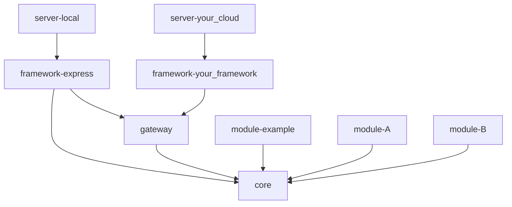

# monomod: A Monorepo Modular Monolith Framework for TypeScript


A framework designed for building highly scalable and maintainable TypeScript applications using a modular monolith architecture. Its could be referenced as the sweet spot between monoliths and microservices.

- [monomod: A Monorepo Modular Monolith Framework for TypeScript](#monomod-a-monorepo-modular-monolith-framework-for-typescript)
  - [Overview](#overview)
  - [Project Structure](#project-structure)
  - [Key Features](#key-features)
  - [When to Use monomod?](#when-to-use-monomod)
  - [Details](#details)
  - [Getting Started](#getting-started)
    - [Prerequisites](#prerequisites)
    - [Basic Setup](#basic-setup)
    - [Upgrading the NX version (Optional)](#upgrading-the-nx-version-optional)
    - [Pushing your changes](#pushing-your-changes)
  - [Common Commands](#common-commands)
  - [Documentation and Resources](#documentation-and-resources)
  - [Troubleshooting](#troubleshooting)
  - [Support](#support)
  - [Contributing](#contributing)
    - [Contributors](#contributors)
  - [License](#license)

## Overview

**monomod** helps you build applications that are:

- 🎯 **Modular**: Each feature is a self-contained module
- 📦 **Monolithic**: Single deployable unit (simpler than microservices)
- 🔄 **Migration-Ready**: Easy path to microservices when needed
- 🛠 **Framework-Agnostic**: Works with Express, Fastify, or your preferred framework



## Project Structure

```markdown
monomod/
├── apps/                  # Applications (servers, CLIs)
├── libs/                  # Core framework libraries
│   ├── core/             # Core domain and utilities
│   ├── gateway/          # API Gateway functionality
│   └── framework/        # Framework adapters (Express, etc)
└── modules/              # Your business modules
    └── example/          # Example module (reference implementation)
```

```markdown
modules/
├── example/
│   ├── src/
│   │   ├── domain/       // Business logic
│   │   ├── application/  // Use cases
│   │   └── infra/       // External interfaces
```

## Key Features

- 🏗 **Hexagonal Architecture**: Clean separation of concerns
- 🔐 **Built-in Gateway**: Authentication, routing, and module management
- 🔌 **Pluggable Infrastructure**: Switch databases or frameworks without touching business logic
- 📊 **NX Monorepo**: Efficient build system and dependency management

## When to Use monomod?

✅ **Perfect for:**

- Startups wanting to move fast without technical debt
- Teams familiar with microservices but wanting simpler deployments
- Projects that might need to scale to microservices in the future

❌ **Not ideal for:**

- Tiny single-purpose applications
- Projects requiring immediate microservice architecture

## Details

For full explanation of what monomod is and how it works see [Project Details](./docs/detail.md)

For full structure details see [Project Structure](./docs/structure.md)

## Getting Started

### Prerequisites

- Node.js ≥ 18.0.0
- NX ≥ 20.0.0
- TypeScript ≥ 5.0.0
- Basic TypeScript knowledge
- Understanding of hexagonal architecture and DDD(recommended)

### Basic Setup

1. Fork the project locally: `git clone --depth=1 https://github.com/Joredjs/monomod.git {{your-project-name}}` the "--depth=1" flag is optional and it is for not get all the project history just the last commit
2. Go to your project directory: `cd {{your-project-name}}`
3. Initialize a new Git repository: `rm -rf .git && git init`
4. Create the fisrt commit: `git add . && git commit -m 'core: initial commit forked from monomod'`
5. Set your project name: For thsi replacing "@monomod/" -> "@{{your-project-name}}/"
6. Install all the dependencies: `npm install`
7. Test the server local project: `nx serve server-local` this will run the default module 'example'
8. Commit the changes with the setup project: `git add . && git commit -m 'core: Setting up {{your-project-name}} project'`

### Upgrading the NX version (Optional)

This is not required, it is up to you if you want to have the last NX version. If you decide to do this, it is at your own responsibility and it could cause some errors that you should fix by yourself.

1. List the version you are using: `nx report`
2. Migrate to the latest NX version: `nx migrate latest`
3. Install all the dependencies: `npm install`
4. Run the migrations: `nx migrate --run-migrations`
5. Test the server local project: `nx serve server-local` this will run the default module 'example'
6. Commit the changes with the setup project: `git add . && git commit -m 'core: migrating nx to latest version'`

### Pushing your changes

1. Add the remote repo: `git remote add origin https://github.com/{{your-username}}/{{your-project-name}}`
2. Push the changes: `git push -u origin main`

Now you are ready to start working in your project, see the [Development Guide](./docs/development.md) for more details.

## Common Commands

```bash
# Development
nx serve server-local     # Start development server
nx test module-example    # Run tests for a module
nx lint module-example    # Lint a module
nx dep                    # Generate dependency graph

# Building
nx build server-local     # Build for production
```

## Documentation and Resources

- 📒 [Full Project Documentation](./docs/detail.md)
- 🏛️ [Architecture Guide](./docs/architecture.md) - Detailed design patterns
- 🏗️ [Structure](./docs/structure.md): Detailed explanation of the project structure
- 👉 [Code Style](./docs/codeStyle.md): Coding conventions and style guidelines
- 🧭 [Development Guide](./docs/development.md): Detailed explanation of how to work in the project
- 📙 [12 Factors](./docs/12factors.md): Adherence to the 12-Factor App methodology
- 🤝 [Contributing](./docs/CONTRIBUTING.md)

## Troubleshooting

Common issues and their solutions:

- Port already in use: Use lsof -i :{port} to find and kill the process
- Module not found: Ensure module is registered in gateway/src/domain/modules.ts
- Type errors: Run npm install to update dependencies and rebuild types

## Support

- 📝 [Issue Tracker](https://github.com/Joredjs/monomod/issues)
- 💬 [Discussions](https://github.com/Joredjs/monomod/discussions)

## Contributing

We welcome contributions! See our [Contributing Guide](./docs/CONTRIBUTING.md) for details.

### Contributors

- Jorge Garay [github.com/joredjs](https://github.com/joredjs)

## License

This project is licensed under the MIT License.
