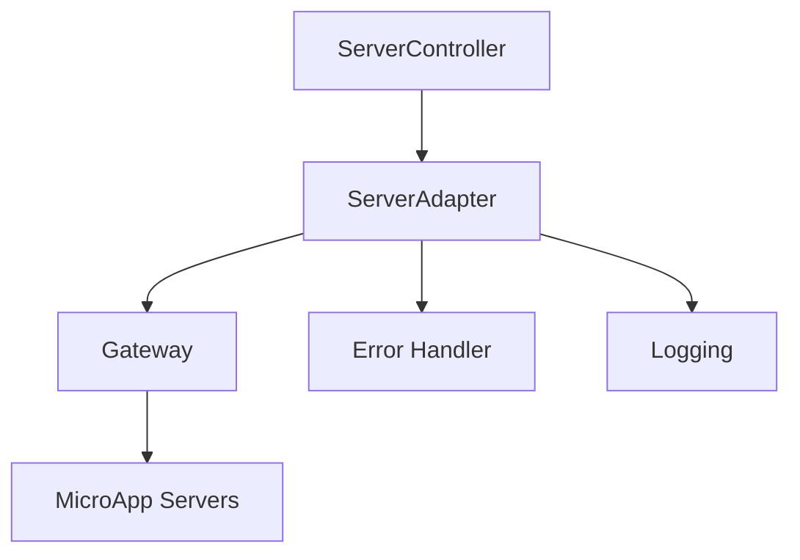

# @monomod/server-local

## Overview

`server-local` is a development server orchestrator for monomod applications. It dynamically retrieves routes from the **monomod gateway** (`@monomod/gateway`), creates server instances for each microapp, and starts them on designated HTTP ports, enabling local development and testing.

## Features

- 🚀 **Dynamic Server Creation**: Automatically creates servers for each microapp
- 🔌 **Framework Agnostic**: Works with Express (default) or any other supported framework
- 🛡️ **Built-in Security**: CORS protection and configurable security features
- 📊 **Development Tools**: Built-in logging and debugging capabilities
- 🔄 **Hot Reload**: Automatic server restart on changes (when used with nx serve)
- 🎯 **Smart Port Management**: Automatic port allocation and conflict resolution

## Key Points

- This application is specifically designed for local development and testing.
- It relies heavily on the **monomod gateway** for route management and other configurations.
- The actual server implementation details are abstracted away by the framework-specific libraries.
- Modular architecture with dependency injection
- Framework-agnostic core with Express implementation
- Configurable through environment and module settings
- Comprehensive error handling and logging
- Support for multiple microapps

## Architecture

### Key Components

- **ServerController**: Main orchestrator for server deployment
- **ServerAdapter**: Framework-specific server implementation
- **ServerPort**: Manages server lifecycle
- **ServerMessagesService**: Handles logging and messages

### Flow Diagram



The `server-local` application follows a modular architecture with dependency injection:

1. **Module System:**
   - Uses a modular system with three main modules:
     - `ModuleCore`: Core services and utilities
     - `ModuleExpress`: Express framework implementation
     - `ModuleServer`: Server-specific components

2. **Dependency Injection:**
   - Utilizes a custom DI container for managing dependencies
   - Components are registered through modules
   - Uses decorators (`@Injectable`, `@Inject`) for dependency management

## Tasks

The `server-local` application acts as an orchestrator for your local development environment. It performs the following key tasks:

1. **Framework Selection:** It identifies the configured backend framework (e.g., Express) based on the provided configuration or conventions.
2. **Route Retrieval:** Through the framework, it communicates with the **monomod gateway** (specifically, the `ApiCore` class) to retrieve the dynamically generated routes and their associated metadata.
3. **Server Instantiation:** For each microapp defined in the gateway, `server-local` leverages the chosen framework library to create and configure an instance of a server (e.g., an Express app).
4. **Server Startup:** It starts each server instance, making the microservices accessible on their designated ports.

## Configuration

The server's behavior is customized through `server.config.ts`:

```typescript
{
  addDomainName: boolean; // Add domain name to server URL
  bodyLimit: string; // Request body size limit (e.g., '5mb')
  debug: {
    cors: boolean; // Enable CORS debugging
    paths: boolean; // Enable path logging
    routes: boolean; // Enable route logging
  }
}
```

## Running the Application

1. Start the server:

```bash
nx serve server-local
```

## Error Handling

The server implements comprehensive error handling:

- Graceful shutdown on SIGINT/SIGTERM
- Server startup error handling
- Request error handling through middleware
- Localized error messages
- Detailed error logging
- Error event propagation

## Logging

- Uses a structured message system through `ServerMessagesService`
- Debug logging for development environments
- Error logging with proper context

## Example

Assuming you have an Express framework configured in `libs/framework/express` and have registered your modules with the gateway. Running `nx serve server-local` will:

1. Instruct the `framework-express` library to retrieve the routes from the gateway.
2. Create an Express server instance for each microapp.
3. Start each server, making your microapps accessible locally.

The console will typically display messages indicating the service name and the port it's listening on.

## Development

For adding new features or modifications:

1. Register new components in appropriate modules
2. Implement required interfaces
3. Use dependency injection for component management
4. Follow the established message pattern for logging

## Best Practices

1. **Configuration**
   - Always validate server configuration
   - Use environment variables for sensitive data
   - Document all configuration options

2. **Error Handling**
   - Implement proper error boundaries
   - Log errors with context
   - Use appropriate error types

3. **Security**
   - Configure CORS appropriately
   - Set proper request size limits
   - Implement rate limiting in production

## Code Walkthrough (src/main.ts)

The `src/main.ts` file is the heart of the `server-local` application. Here's a breakdown of its key components:

1. **Import Dependencies:**
   - `Config` from `server.config.ts`: Contains the application's configuration settings.
   - `ApiCore` from `@monomod/gateway`: Used to interact with the gateway and retrieve microapp routes.
   - `Framework` from `libs/framework/*`: The framework-specific library for server instantiation and configuration.

2. **Initialize Framework:**
   - The `Framework` class is instantiated, providing the necessary framework-specific functionality and the application's configuration.

3. **Retrieve Routes:**
   - The `ApiCore` class is used to fetch the microapps information from the gateway.

4. **Create Servers:**
   - For each microapp retrieved from the gateway, the `Framework` class is used to create a server instance.

5. **Start Servers:**
   - Each server instance is started, making the microapps accessible on their designated ports.

6. **Logging:**
   - The application logs information about the started servers, including their names and ports.

## Conclusion

The `server-local` application provides a streamlined and efficient way to manage local development servers for monomod microapps. Its dynamic route retrieval, framework abstraction, and easy configuration make it a valuable tool for developers working on monomod project.
