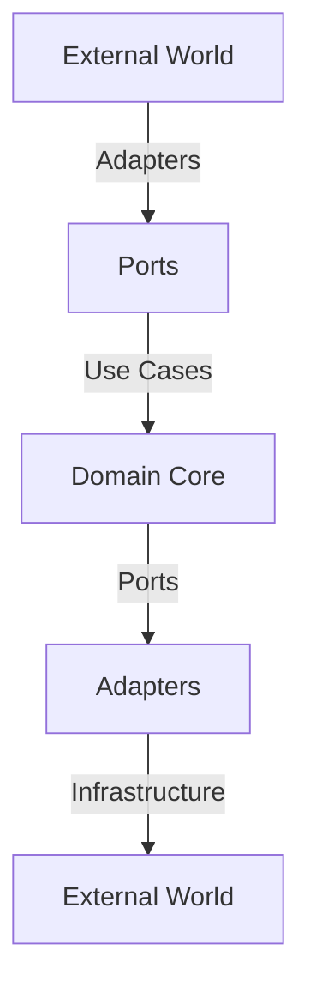
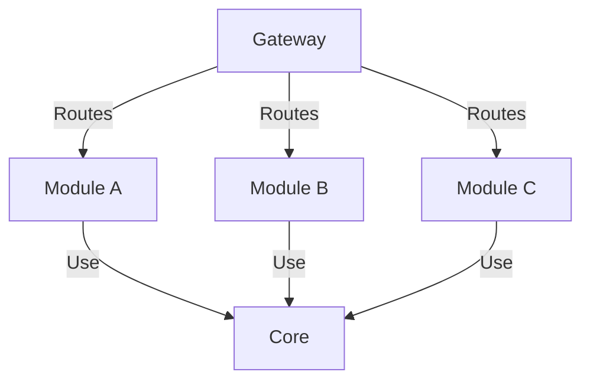

# monomod Architecture

## Overview

monomod implements a modular monolith architecture using hexagonal (ports & adapters) design principles it allows separate the core business logic of an application from its external dependencies. This separation allows for greater flexibility, maintainability, and testability. This document details the architectural decisions, patterns, and implementation guidelines.

## Core Architecture Principles

### 1. Hexagonal Architecture



Each module follows the hexagonal architecture pattern with three main layers:

- **Domain**: Core business logic and entities
- **Application**: Use cases and ports
- **Infrastructure**: External adapters and implementations

### 2. Module Independence

Each module is designed to be independent, with minimal dependencies on other modules. This promotes modularity and reusability.

### 3. Configuration Management

Configuration is managed through environment variables, configuration files, and dependency injection. This ensures flexibility and ease of deployment.



Modules are completely independent, communicating only through well-defined interfaces:

- No direct dependencies between modules
- Shared functionality through core library
- Gateway-managed communication

### 3. Gateway Pattern

The gateway (`@monomod/gateway`) serves as:

- Central routing mechanism
- Authentication/Authorization handler
- Module orchestrator
- Cross-cutting concerns manager

## Implementation Details

### 1. Core Components

#### Gateway Implementation

The gateway serves as the central orchestrator for all modules:

```typescript
// Example of gateway route registration
export class Gateway {
  private modules: Map<string, IModule> = new Map();

  registerModule(module: IModule): void {
    const routes = module.getRoutes();
    this.validateRoutes(routes);
    this.modules.set(module.getName(), module);
  }

  private validateRoutes(routes: IRoute[]): void {
    // Validate route uniqueness and format
    // Check for conflicts
    // Validate schema definitions
  }
}
```

#### Authentication Flow

```typescript
// Gateway authentication middleware
export class AuthMiddleware implements IMiddleware {
  async handle(request: IRequest): Promise<void> {
    const token = request.headers.authorization;
    const user = await this.authService.validateToken(token);
    request.user = user;
  }
}
```

#### Route Management

```typescript
// Dynamic route registration
export interface IRouteGroup {
  group: string;
  versions: string[];
  headers: IHeaderGroup;
  paths: {
    [key: string]: {
      method: HttpMethod;
      schema: ISchema;
      handler: string;
    };
  };
}
```

### Framework Adapters (`@monomod/framework-express`)

Framework adapters translate gateway configurations into framework-specific implementations:

```typescript
// Express adapter example
export class ExpressAdapter implements IFrameworkAdapter {
  private app: Express;

  constructor() {
    this.app = express();
    this.setupMiddleware();
  }

  registerRoute(route: IRoute): void {
    const { method, path, handler, middleware } = route;
    this.app[method](path, ...middleware, handler);
  }

  private setupMiddleware(): void {
    this.app.use(cors());
    this.app.use(bodyParser.json());
    this.app.use(this.errorHandler.bind(this));
  }
}
```

### 2. Module Structure

Each module follows this structure:

```markdown
module/
├── application/
│ ├── ports/ # Interface definitions
│ ├── useCases/ # Business operations
│ └── services/ # Shared services
├── domain/
│ ├── entities/ # Business objects
│ ├── repositories/ # Data access interfaces
│ └── value-objects/ # Immutable values
└── infrastructure/
├── controllers/ # Request handlers
├── repositories/ # Data access implementations
└── services/ # External service implementations
```

#### Application Layer

The application layer contains use cases and port definitions:

```typescript
// Port definition
export interface IUserPort {
  createUser(params: ICreateUserParams): Promise<Result<IUser>>;
  getUser(id: string): Promise<Result<IUser>>;
}

// Use case implementation
export class CreateUserUseCase implements IUseCase<ICreateUserParams, IUser> {
  constructor(
    private userRepository: IUserRepository,
    private emailService: IEmailService
  ) {}

  async execute(params: ICreateUserParams): Promise<Result<IUser>> {
    // Validation
    const validationResult = await this.validateParams(params);
    if (validationResult.isFailure) {
      return Result.fail(validationResult.error);
    }

    // Business logic
    const user = await this.userRepository.create(params);
    await this.emailService.sendWelcomeEmail(user.email);

    return Result.ok(user);
  }
}
```

#### Domain Layer

Contains business logic and entity definitions:

```typescript
// Entity definition
export class User implements IUser {
  private constructor(
    public readonly id: string,
    public readonly email: string,
    private password: string,
    public readonly createdAt: Date
  ) {}

  static create(params: ICreateUserParams): Result<User> {
    // Domain validation
    if (!this.isValidEmail(params.email)) {
      return Result.fail(new InvalidEmailError());
    }

    return Result.ok(new User(
      uuidv4(),
      params.email,
      params.password,
      new Date()
    ));
  }

  // Domain methods
  changePassword(oldPassword: string, newPassword: string): Result<void> {
    if (!this.validatePassword(oldPassword)) {
      return Result.fail(new InvalidPasswordError());
    }
    this.password = newPassword;
    return Result.ok();
  }
}
```

#### Infrastructure Layer

Implements external interfaces and adapters:

```typescript
// Repository implementation
export class PostgresUserRepository implements IUserRepository {
  constructor(private db: Database) {}

  async create(user: User): Promise<void> {
    await this.db.query(
      'INSERT INTO users (id, email, password) VALUES ($1, $2, $3)',
      [user.id, user.email, user.password]
    );
  }

  async findById(id: string): Promise<User | null> {
    const result = await this.db.query(
      'SELECT * FROM users WHERE id = $1',
      [id]
    );
    return result.rows[0] ? this.mapToUser(result.rows[0]) : null;
  }
}

// Controller implementation
export class UserController implements IController {
  constructor(
    private createUserUseCase: CreateUserUseCase,
    private getUserUseCase: GetUserUseCase
  ) {}

  async createUser(req: IRequest): Promise<IResponse> {
    const result = await this.createUserUseCase.execute(req.body);
    
    if (result.isFailure) {
      return {
        statusCode: 400,
        body: { error: result.error.message }
      };
    }

    return {
      statusCode: 201,
      body: result.getValue()
    };
  }
}
```

### 3. Cross-Module Communication

Modules communicate through well-defined interfaces:

```typescript
// Event-based communication
export interface IEventBus {
  publish<T>(event: IDomainEvent<T>): Promise<void>;
  subscribe<T>(
    eventName: string, 
    handler: (event: IDomainEvent<T>) => Promise<void>
  ): void;
}

// Example usage in a module
export class OrderCreatedHandler {
  constructor(private eventBus: IEventBus) {
    this.eventBus.subscribe<IOrderCreatedEvent>(
      'OrderCreated',
      this.handleOrderCreated.bind(this)
    );
  }

  private async handleOrderCreated(event: IDomainEvent<IOrderCreatedEvent>): Promise<void> {
    // Handle order creation
    await this.notificationService.notify(event.data.userId);
  }
}
```

### 4. Error Handling

Standardized error handling across modules:

```typescript
// Base error class
export abstract class DomainError extends Error {
  constructor(message: string) {
    super(message);
    this.name = this.constructor.name;
  }
}

// Example domain error
export class InvalidEmailError extends DomainError {
  constructor() {
    super('The email provided is invalid');
  }
}

// Error handler middleware
export class ErrorHandler implements IErrorHandler {
  handle(error: Error): IResponse {
    if (error instanceof DomainError) {
      return {
        statusCode: 400,
        body: { error: error.message }
      };
    }

    // Log unexpected errors
    logger.error(error);
    return {
      statusCode: 500,
      body: { error: 'Internal server error' }
    };
  }
}
```

### 5. Request Flow

1. **External Request** → Gateway
2. **Gateway** → Module Selection & Routing
3. **Module Controller** → Use Case Execution
4. **Use Case** → Domain Logic
5. **Infrastructure** → External Systems
6. **Response** → Client

## Design Patterns

### 1. Dependency Injection Pattern

monomod uses a custom DI container that's framework-agnostic:

```typescript
// Core DI container
export class Container implements IContainer {
  private services: Map<string, ServiceDefinition> = new Map();

  // Register a service
  register<T>(token: string, definition: ServiceDefinition<T>): void {
    this.services.set(token, {
      implementation: definition.implementation,
      lifetime: definition.lifetime || 'singleton',
      factory: definition.factory
    });
  }

  // Resolve a service
  resolve<T>(token: string): T {
    const definition = this.services.get(token);
    if (!definition) {
      throw new ServiceNotFoundError(token);
    }
    return this.createInstance(definition);
  }
}

// Usage in modules
@Injectable()
export class UserService {
  constructor(
    @Inject('IUserRepository') private userRepo: IUserRepository,
    @Inject('IEmailService') private emailService: IEmailService
  ) {}
}
```

### 2. Repository Pattern

Separates domain logic from data access:

```typescript
// Domain repository interface
export interface IUserRepository {
  findById(id: string): Promise<User | null>;
  findByEmail(email: string): Promise<User | null>;
  save(user: User): Promise<void>;
  delete(id: string): Promise<void>;
}

// Infrastructure implementation
@Injectable()
export class PostgresUserRepository implements IUserRepository {
  constructor(
    @Inject('DATABASE_CONNECTION') private db: Database,
    @Inject('QUERY_BUILDER') private queryBuilder: QueryBuilder
  ) {}

  async findById(id: string): Promise<User | null> {
    const query = this.queryBuilder
      .select()
      .from('users')
      .where('id = :id')
      .build();

    const result = await this.db.execute(query, { id });
    return result.rows[0] ? User.fromDTO(result.rows[0]) : null;
  }

  async save(user: User): Promise<void> {
    const query = this.queryBuilder
      .insert('users')
      .values(user.toDTO())
      .onConflict('id')
      .doUpdate()
      .build();

    await this.db.execute(query);
  }
}
```

### 3. Use Case Pattern

Encapsulates business logic in single-responsibility classes:

```typescript
// Use case interface
export interface IUseCase<TParams, TResult> {
  execute(params: TParams): Promise<Result<TResult>>;
}

// Use case implementation
@Injectable()
export class CreateUserUseCase implements IUseCase<CreateUserDTO, User> {
  constructor(
    @Inject('IUserRepository') private userRepo: IUserRepository,
    @Inject('IEmailValidator') private emailValidator: IEmailValidator,
    @Inject('IPasswordHasher') private passwordHasher: IPasswordHasher
  ) {}

  async execute(params: CreateUserDTO): Promise<Result<User>> {
    // 1. Input validation
    const validationResult = await this.validateInput(params);
    if (validationResult.isFailure) {
      return Result.fail(validationResult.error);
    }

    // 2. Business rules
    const existingUser = await this.userRepo.findByEmail(params.email);
    if (existingUser) {
      return Result.fail(new UserAlreadyExistsError());
    }

    // 3. Domain operation
    const userOrError = User.create({
      email: params.email,
      password: await this.passwordHasher.hash(params.password)
    });

    if (userOrError.isFailure) {
      return Result.fail(userOrError.error);
    }

    // 4. Persistence
    const user = userOrError.getValue();
    await this.userRepo.save(user);

    return Result.ok(user);
  }
}
```

### 4. Observer Pattern

Used for event-driven communication between modules:

```typescript
// Event definitions
export interface IDomainEvent<T> {
  eventName: string;
  data: T;
  timestamp: Date;
  metadata: EventMetadata;
}

// Event bus implementation
@Injectable()
export class EventBus implements IEventBus {
  private handlers: Map<string, EventHandler[]> = new Map();

  subscribe<T>(eventName: string, handler: EventHandler<T>): void {
    const handlers = this.handlers.get(eventName) || [];
    handlers.push(handler);
    this.handlers.set(eventName, handlers);
  }

  async publish<T>(event: IDomainEvent<T>): Promise<void> {
    const handlers = this.handlers.get(event.eventName) || [];
    await Promise.all(
      handlers.map(handler => handler(event))
    );
  }
}

// Usage in domain events
@Injectable()
export class UserCreatedHandler {
  constructor(
    @Inject('IEventBus') private eventBus: IEventBus,
    @Inject('IEmailService') private emailService: IEmailService
  ) {
    this.eventBus.subscribe('UserCreated', this.handleUserCreated.bind(this));
  }

  private async handleUserCreated(event: IDomainEvent<UserCreatedData>): Promise<void> {
    await this.emailService.sendWelcomeEmail(event.data.email);
  }
}
```

### 5. Factory Pattern

Used for creating complex objects:

```typescript
// Module factory interface
export interface IModuleFactory {
  createModule(config: ModuleConfig): IModule;
}

// Implementation
@Injectable()
export class ModuleFactory implements IModuleFactory {
  constructor(
    @Inject('IContainer') private container: IContainer
  ) {}

  createModule(config: ModuleConfig): IModule {
    // 1. Register module-specific services
    this.registerServices(config.services);

    // 2. Create controllers
    const controllers = this.createControllers(config.controllers);

    // 3. Create routes
    const routes = this.createRoutes(config.routes, controllers);

    // 4. Create and return module instance
    return new Module(
      config.name,
      routes,
      controllers,
      this.container
    );
  }
}
```

### 6. Strategy Pattern

Used for implementing interchangeable algorithms:

```typescript
// Strategy interface
export interface IAuthenticationStrategy {
  authenticate(credentials: any): Promise<Result<IUser>>;
}

// JWT implementation
@Injectable()
export class JwtStrategy implements IAuthenticationStrategy {
  constructor(
    @Inject('IJwtService') private jwtService: IJwtService,
    @Inject('IUserRepository') private userRepo: IUserRepository
  ) {}

  async authenticate(token: string): Promise<Result<IUser>> {
    try {
      const payload = await this.jwtService.verify(token);
      const user = await this.userRepo.findById(payload.sub);
      return user ? Result.ok(user) : Result.fail(new UserNotFoundError());
    } catch (error) {
      return Result.fail(new InvalidTokenError());
    }
  }
}

// Usage in authentication service
@Injectable()
export class AuthenticationService {
  constructor(
    @Inject('IAuthenticationStrategy') 
    private strategy: IAuthenticationStrategy
  ) {}

  async authenticate(credentials: any): Promise<Result<IUser>> {
    return this.strategy.authenticate(credentials);
  }
}
```

These patterns work together to create a flexible, maintainable, and testable architecture. Each pattern serves a specific purpose:

- **Dependency Injection**: Manages service dependencies and promotes loose coupling
- **Repository**: Abstracts data access and enables easy switching of data sources
- **Use Case**: Encapsulates business logic and maintains single responsibility
- **Observer**: Enables loose coupling for event-driven architecture
- **Factory**: Manages complex object creation
- **Strategy**: Enables runtime algorithm selection

## Related Documentation

- [Project Structure](./structure.md)
- [Development Guide](./development.md)
- [12 Factors Implementation](./12factors.md)
