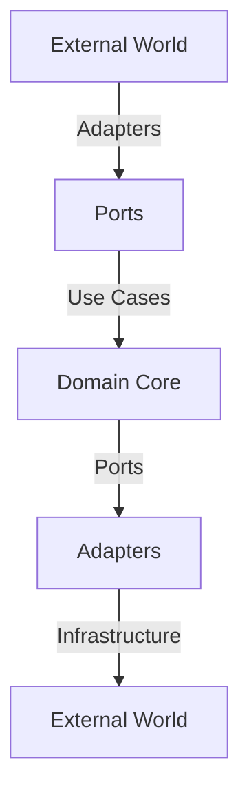
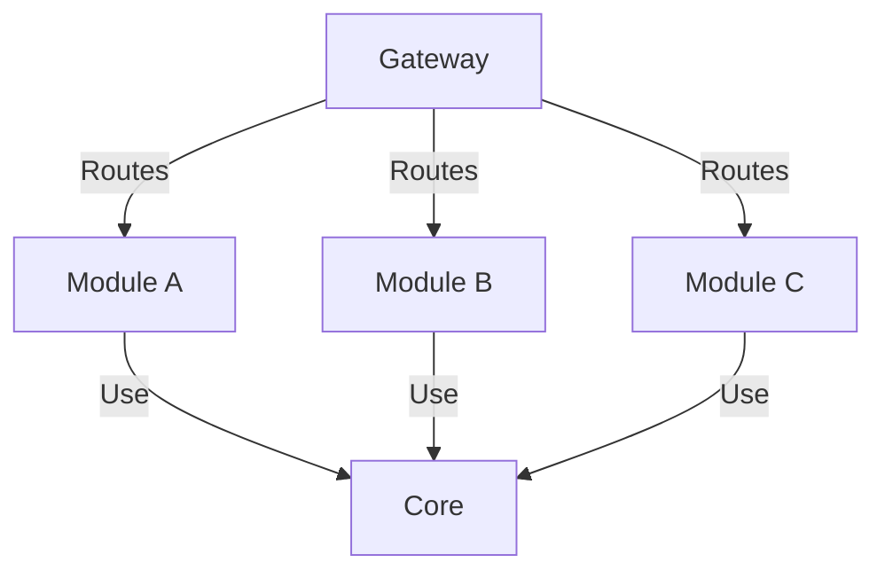

# Project Architecture

## Hexagonal Architecture

Hexagonal Architecture, also known as *ports & adapters*, is a design pattern that separates the core business logic of an application from its external dependencies. This separation allows for greater flexibility, maintainability, and testability.

## Core Architecture Principles

### Hexagonal Architecture

Each module follows the hexagonal architecture pattern with three main layers:

- **Domain**: Core business logic and entities
- **Application**: Use cases and ports
- **Infrastructure**: External adapters and implementations

### Domain-Driven Design

**monomod** encourages the organization of code around business domains, promoting maintainability and scalability.

### Module Independence

Each module is designed to be independent, representing a specific business domain with minimal dependencies on other modules. This promotes modularity and reusability.

### Configuration Management

Configuration is managed through environment variables, configuration files, and dependency injection. This ensures flexibility and ease of deployment.

Modules are completely independent, communicating only through well-defined interfaces:

- No direct dependencies between modules
- Shared functionality through core library
- Gateway-managed communication

### Framework Agnosticism

  **monomod** allow you to configurate any backend framework (e.g., `@monomod/framework-express` for Express), allowing you to use familiar tools while abstracting framework-specific details.

### Server Agnosticism

Deploy your **monomod application** to any server environment, whether it's a local machine, a cloud provider like AWS or Azure, or a container orchestration platform like Kubernetes.

### 4. Gateway Pattern

The gateway (`@monomod/gateway`) serves as:

- Central routing mechanism
- Authentication/Authorization handler
- Module orchestrator
- Cross-cutting concerns manager

## Project Structure

**monomod** employs a layered architecture, promoting separation of concerns and maintainability. The core layers include:

- **Apps:**  Contains runnable projects (servers, potentially frontends).
  - **Servers:** Houses server configurations for different environments (local, AWS, Firebase, etc.).
  - **Fronts:** Accommodates frontend applications within the monorepo (currently not extensively defined).
- **Libs:** Comprises reusable modules accessible across the project.
  - **Framework:** Manages backend framework configurations (Express, Fastify, etc.).
  - **Gateway:** Acts as an API gateway, handling routing, authentication, authorization, and module injection.
  - **Core:** Contains the core logic, interface definitions, and fundamental components.
- **Modules:** Represents individual domain groups, each structured with:
  - **Application:** Houses application logic and port definitions.
  - **Domain:** Contains domain entities, interfaces, and repositories.
  - **Infra:** Provides concrete implementations for controllers and interactions with external systems.

For further details, see [Project Structure](./structure.md)

## Example

Let's say you're building an e-commerce application. You could have separate modules for `users`, `products`, `orders`, and `payments`. Each module would handle its own data, logic, and API endpoints. The **monomod** Gateway would route incoming requests to the appropriate module based on the path, version, and HTTP method. The framework adapter (e.g., `framework-express`) would then handle the underlying server implementation, creating an Express server instance for each module and exposing the routes.

In this projectby default you will find an example module called `example` with some basic configuration in it, and registered on the **monomod gateway**
