# Project Structure

- [Project Structure](#project-structure)
  - [Apps](#apps)
    - [Servers](#servers)
    - [Front](#front)
  - [Libs](#libs)
    - [Framework](#framework)
    - [Gateway](#gateway)
    - [Core](#core)
  - [Modules](#modules)
  - [Architecture](#architecture)
    - [Graph](#graph)
    - [Dependecy cruiser](#dependecy-cruiser)

This document outlines the structural organization of the **monomod** project. The primary architectural pattern employed across most libraries is the hexagonal architecture, also known as *ports & adapters*. Each library adhering to this pattern should consist of the following folders (layers):

- **application:** This layer contains the application logic, orchestrating the interaction between domain entities and infrastructure concerns.
- **domain:** This layer encapsulates the core business logic, including entities, value objects, and business rules. It remains independent of any framework or infrastructure concerns.
- **infra:** This layer provides concrete implementations for interacting with external dependencies, such as databases, APIs, or the file system. It adapts the domain logic to specific technologies.

The monorepo itself is structured into three abstraction layers: **apps**, **libs**, and **modules**.

## Apps

This layer houses projects capable of being "served" or executed independently. It is further categorized into `servers` and `fronts`.

### Servers

This category encompasses the various server configurations, each designed to be decoupled from specific backend frameworks. Examples include:

- `server-local`: A local development server for running and testing **monomod** modules independently.

Other server implementations could include deployments for AWS, Firebase functions, Google Cloud functions, Azure functions, etc.

Due to the typically concise nature of server implementations, adhering to the hexagonal architecture within this layer is not mandatory.

### Front

While currently not extensively defined within the repository, this category accommodates frontend applications that may be part of the monorepo.

## Libs

This layer comprises reusable modules accessible by both apps and individual modules. It is subdivided into `gateway`, `framework`, and `core`.

### Framework

This category manages the configuration of backend frameworks utilized by the servers.  Examples include:

- `framework-express`:  Handles the configuration and setup of the Express framework within **monomod**.

Other framework implementations could include Fastify, Koa, NestJS, etc.

To minimize framework coupling, these frameworks act as intermediaries, with the core application logic residing in the `core` layer.

Given the often compact implementation of framework-related code, strict adherence to the hexagonal architecture is not always necessary. However, as implementations grow, following the architectural guidelines is recommended.

### Gateway

This layer functions as an API gateway, gathering information about modules to be exposed and presenting them to the chosen framework for serving. The gateway, represented by the `@monomod/gateway` library, facilitates API control, handling aspects like:

- Authentication
- Authorization
- Dynamic Routing
- Module Injection
- Security Validations

It generates route listings based on domain groups and exposes them for framework-specific implementation. These routes are designed to be agnostic of any particular backend framework.

### Core

This layer, represented by the `@monomod/core` library, represents the project's core, serving as a dependency for all other layers without having dependencies itself. It houses:

- Central logic
- Interface definitions
- Keys
- Services
- Base controllers
- Other fundamental components

## Modules

This layer contains the individual modules (domain groups) of the application.

Each module should adhere to the following structure:

```markdown
./mymodule
├── src
│   ├── application/
│   │   ├── useCases/
│   │   │   └── myfeature.useCase.ts
│   │   └── port.ts
│   ├── domain/
│   │   ├── interface.ts (If applicable)
│   │   ├── repository.ts (If applicable)
│   │   └── routes.ts
│   ├── infra/
│   │   └── controller.ts
└── ... (config files)
```

**Explanation:**

- **application:** Contains use cases (application logic) and port definitions (interfaces for interacting with other layers).
- **domain:** Houses domain entities, interfaces, and repositories (if applicable).
- **infra:** Provides concrete implementations for controllers, interacting with external systems or frameworks.

This structure promotes modularity, maintainability, and testability by clearly separating concerns and adhering to the principles of hexagonal architecture.

## Architecture

As is mentioned above the used architecture in **monomod** is hexagonal. Here there are some diagrams detailing how the project structure fits in this architecture, you can generate by yourself the nx graph and the dependecy cruiser diagrams.

```shell
nx dep
nx graph
```

### Graph

Graph created by nx:


### Dependecy cruiser

- Compact:

```mermaid
%%{init: {
  'theme': 'base',
  'themeVariables': {
    'primaryColor': '#F3F2FD',
    'primaryTextColor': '#333',
    'primaryBorderColor': '#90CAF9',
    'lineColor': '#DD1619',
    'secondaryColor': '#FFFFFF00',
    'tertiaryColor': '#FFF3E0'
  }
}}%%

graph TD
    subgraph apps[" Apps"]
        servers["🖥️ servers"]
    end

    subgraph libs[" Libs"]
        framework["⚡ framework"]
        gateway["🔗 gateway"]
        core["💎 core"]
    end

    subgraph modules ["📚 modules"]
    end

    subgraph external[" External Dependencies"]
        crypto["🔒 crypto"]
    end

    %% Connections
    servers --> |"uses"| framework
    
    framework --> |"depends on"| core
    framework --> |"uses"| gateway
    
    gateway --> |"depends on"| core
    gateway -.-> |"imports"| crypto
    gateway --> |"uses"| modules
    
    modules --> |"depends on"| core

    %% Styling classes
    classDef default fill:#fff,stroke:#333,stroke-width:2px,rx:5px
    classDef deps fill:#fffde3,stroke:#ffa726,stroke-width:2px,rx:5px
    classDef proyecto fill:#b8d6ed,stroke:#1333e6,stroke-width:2px
    classDef carpeta fill:#ccf1cf,stroke:#1f6e00,stroke-width:2px,rx:5px
    
    %% Apply custom styles
    class servers,framework,gateway default
    class crypto deps
    class servers,core,framework,gateway proyecto
    class apps,libs,modules carpeta
```



- Full:


